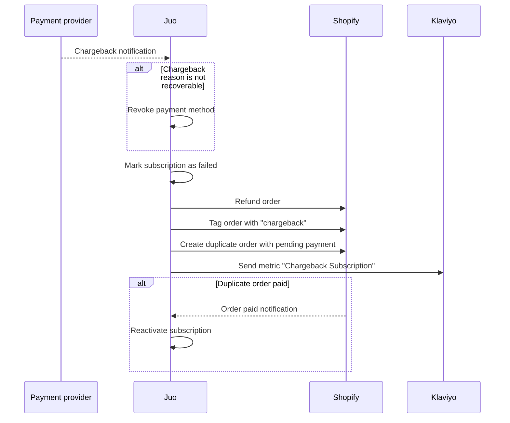

<Tip>
Juo has a built-in chargeback dunning flow to help recover lost revenue from failed SEPA Direct Debit payments. If you use SEPA payment methods enabled for subscriptions, you can enable it in Juo **Experiences** > **Retention**.

For more information about SEPA DD chargebacks, check our [Guide to SEPA Direct Debit](/sepa-direct-debit)

</Tip>

This flow helps recover lost revenue while minimizing failed transactions. Payment providers and banks may charge additional fees for failed SEPA payment transactions (read more in [**Mollie Support**)](https://help.mollie.com/hc/en-us/articles/115000796469-What-is-a-SEPA-Direct-Debit-chargeback).

When a chargeback occurs on a subscription payment, Juo triggers a recovery flow to help merchants receive their renewal payment. Please see the description below to learn how this flow works for recoverable\* chargeback reasons.

### What happens after a chargeback?

**Subscription**

- Status is set to `Failed`

**Order**

- Automatically refunded
- Tagged with `chargeback`
- Duplicated as a new order with a pending payment

**→ Klaviyo receives**

- Chargeback event with reason code and message
- Link to Shopify checkout for the duplicated pending order

<Note>
  **Action required:** based on the information sent to Klaviyo set up the
  custom notification that will be sent to customers after chargebacks. See our{" "}
  [Klaviyo integration guide](/klaviyo-integration).for details
</Note>

**Customer pays for the duplicated order**

- Subscription gets reactivated

<Note>

To view **orders** with chargebacks use Tag filtering in Shopify: `chargeback`

To view **subscriptions** with chargebacks use Status filtering in Juo: `Failed`

</Note>
*Juo retries payments only for recoverable chargeback reasons (e.g., **AM04 – Insufficient funds**). For non-recoverable chargebacks, Juo still sends the chargeback reason to Klaviyo, but then **revokes the payment method**. The customer must start a new subscription with a valid payment method.

---

Juo chargeback dunning flow:

