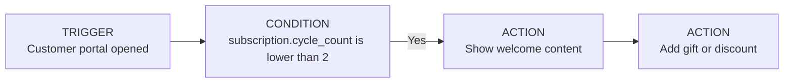

New subscribers are in the **highest churn-risk window**. Some of them are already loyal returning buyers, some are only trying out your product, and others may have subscribed by accident. A strong onboarding workflow helps them understand the value of your product and builds the habit that drives long-term retention.

These are just some of the reasons why churn tends to be highest in this segment. But that also means that if you get subscribers past the threshold of the first recurring order, you are much more likely to keep them for the months to come.

## Welcome message for new subscribers

A workflow using the **Customer portal opened** trigger lets you display a pop-up with optional text, image, or video for subscribers in their first cycle. It is a perfect opportunity to personally thank them, explain the value of your product, and show them why being a subscriber is worth it.

A well-crafted message is often enough to convert hesitation into loyalty.

**Trigger:** Customer portal opened  
**Condition:** `subscription.cycle_count` is lower than `2`  
 **Action:** Show content

## Welcome gift

You can accompany the welcome message with a free product or a discount for the next few renewals. Making subscribers feel special and giving them something to look forward to can drastically decrease early drop-off.

**Action:** Add product / Apply discount

<video
  controls
  playsInline
  preload="metadata"
  style={{ width: "100%", borderRadius: 12 }}
>
  <source src="https://cdn.juo.io/content-uploads/New_subscriber_welcome_Workflows_Juo_Showroom_Juo_29_April_2026_bf0a1a95c5.mp4" type="video/mp4" />
  Your browser does not support the video tag.
</video>

## Cancellation flow

New subscribers often have different reasons for cancelling than long-time subscribers. Address them with a personalized flow and offer actions that can convince them to stay.

Read more about Cancellation flows.